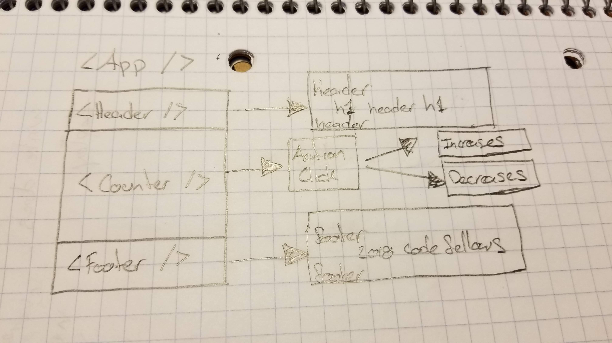

# LAB - 27 Testing and Deployment 

### Author: Felipe Delatorre

### Links and Resources
* [submission PR](https://github.com/401-advanced-javascript-felipe/lab27-reactTestingAndDeployment/pull/1)
* [travis](https://travis-ci.com/401-advanced-javascript-felipe/lab27-reactTestingAndDeployment)
* [Netlify](https://gifted-booth-86ec49.netlify.com/)
* [AWS](http://lab27-counter-react.s3-website-us-west-2.amazonaws.com/)

#### Documentation
* [styleguide](styleguide\index.html)

### Modules
#### `Counter.js`

`handleButtonClick(e)` Increase the counter by one

`handleDecrementClick(e)` Decreases the counter by one

#### Running the app
* `npm start` - Will start at localhost:3000

#### Tests
* `npm test` - Will run 3 tests for counter

#### UML

